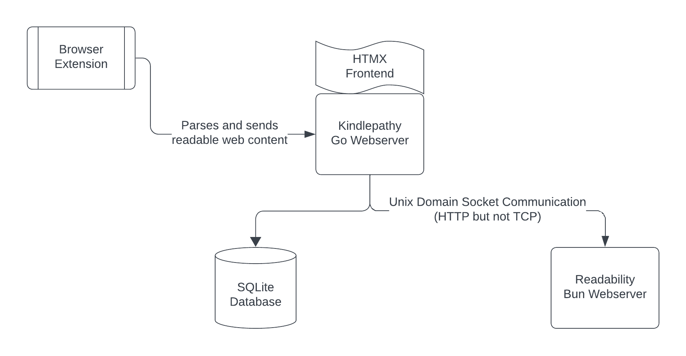

You can try it out at [kindlepathy.com](https://kindlepathy.com).


Browser extension can optionally be downloaded from [Chrome Web Store](https://chromewebstore.google.com/detail/eclacjdfoacbmgoiongjpmlaangpmbac) or [Mozilla Add-ons](https://addons.mozilla.org/en-US/firefox/addon/kindlepathy-extractor).

### Motivation

I love my kindle and want to read web content (mainly blogposts alongside some grayscale manga) on it.

You could go directly to the website itself. Not all websites are kindle-browser friendly, entering the page url by hand is not fun, sometimes you need to authenticate to access content.

You could make the posts you want to read into books via calibre or some online service. Reading experience is excellent, but you pollute your library with many small books. Sending those books is not instant as well.

**Kindlepathy** is somewhere in the middle. We parse the website content with Readability.js which powers the reading mode of Firefox, into a clean, simple and light HTML. We then let serve all of these web contents in a single url `/read`, which you can control with your other devices like your phone, using the `/library` page.

### How to use

**_Sign up_** with your phone or pc. **_Login_** from your reader's web browser with your credentials.

- If the content is public, **_paste the url into `/library`_** on your phone or pc.
- If its behind authentication, or you prefer the convenience, **_use the extension_** to submit the current web page's content from your PC browser.

**_Refresh_** the `/read` page on your reader, read the content that is added or selected last.

### Architecture



**_Database:_** SQLite, which keeps things simple and self contained.

**_Extraction:_** [Readability.js](https://github.com/mozilla/readability) is used to extract the textual content from the page, discarding all the fluff.

- In the **extension**, the library is used on the browser and the clean page is sent to the server.
- In the **server**, since this is a JS library and not Go, we have a simple HTTP server written in Bun JS, that abstracts the library away into a HTTP JSON request. We compile this webserver into a single executable, run it as a child process of the go server, and communicate with it via HTTP over an Unix Domain Socket (UDS) instead of TCP.

**_Frontend:_** HTMX, to keep it simple. `/library` page controls what is being served on `/read` for any given user.

**_Deployed_** on a small VPS, as a single container, behind a self-signed certificate using nginx.

Everything is delightfully self-contained and straightforward.

### How to run

Some environment variables need to be set.

```sh
docker compose up
```

or

```sh
cd readability && make ./readability && cd ..
go run ./...
```
